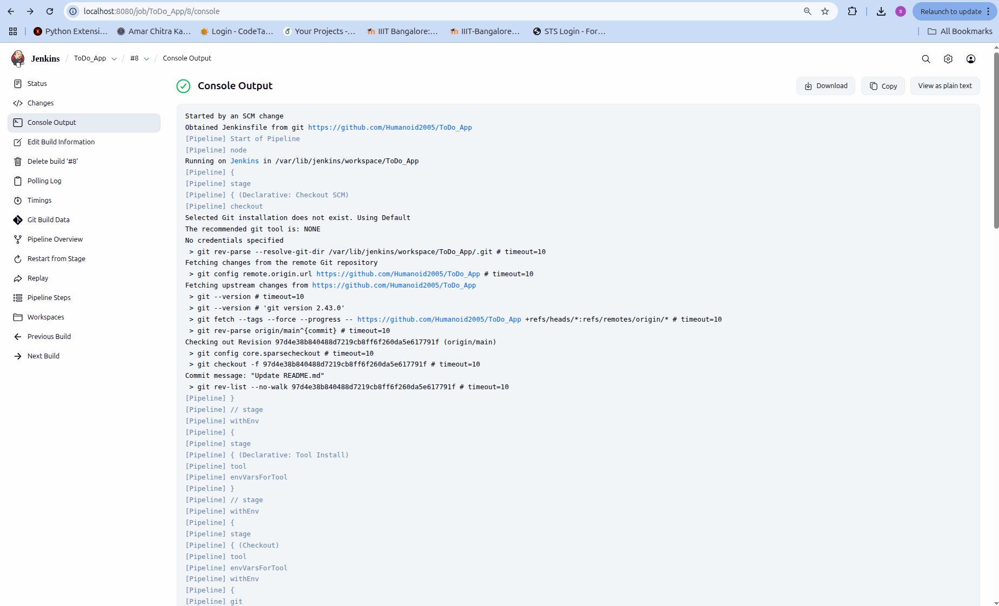
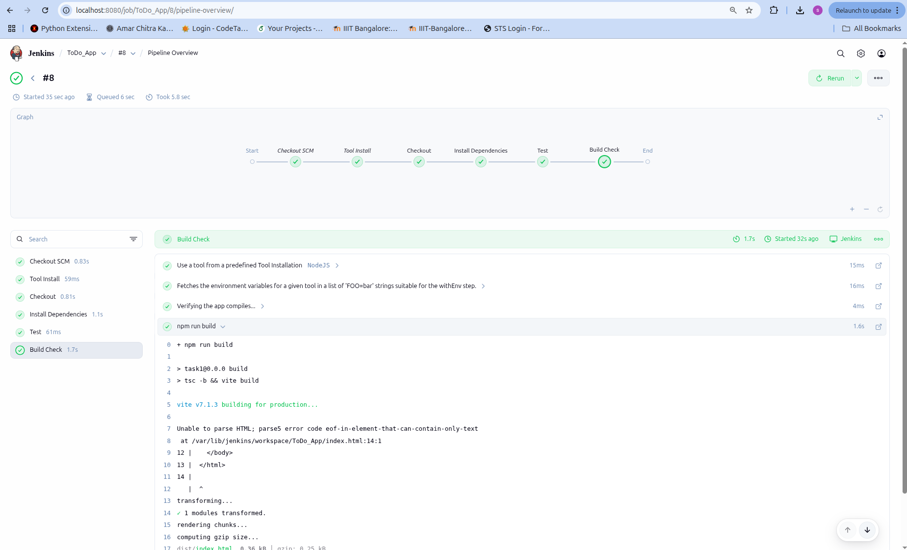

# ToDo App

A simple task management application for creating, tracking, and managing your daily tasks.

## Tech Stack

- React JS + TypeScript
- Vite (Build tool)
- React Router
- Docker
- Jenkins

## Folder Structure

```
├── src/
│   ├── components/      # UI components
│   ├── containers/      # Container components
│   ├── contexts/        # React contexts
│   ├── models/          # Data models
│   ├── viewModels/      # Business logic
│   └── styles/          # CSS files
├── public/              # Static assets
├── Dockerfile           # Docker configuration
└── Jenkinsfile          # Jenkins CI/CD pipeline
```

## DevOps

- **Docker**: Containerization for consistent deployment
- **Jenkins**: Automated CI/CD pipeline

## Run Locally

```bash
# Install dependencies
npm install

# Start development server
npm run dev

# Build for production
npm run build
```

## How to run the docker container

```bash
    docker run -p 5173:5173 humanoid2005/todo-app:v1
```

## Pipeline Build Overview



## Pipeline Console Log



## Complete Pipeline Console Logs PDF


